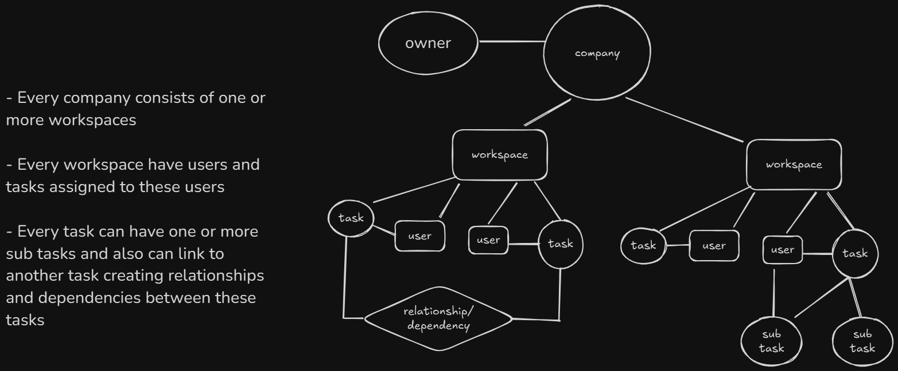
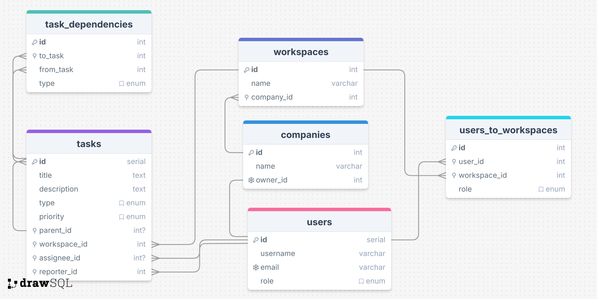

# Overview

This is jira api clone created by **nest** js framework , **mikro orm** and **postgres sql** .

# Application Entities hieararchy



<br>

# Database ERD



<br>

# Getting started

## Installation

```bash
$ npm install
```

# Running the app

```bash
$ npm run start

# watch mode
$ npm run start:dev

# production mode
$ npm run build
$ npm run start:prod
```

### Postman collection : [api collection](./documentation/Jira-api-clone.postman_collection.json)

<br>

# Authorization :

**`cookie attached jwt token` that is generated after successfull login or registration and is sent with all subsequent reuests until expired**

<br>

# Endpoints :

## Auth :

### Register a New User

Registers a new user in the system, allowing either regular registration or via an invitation link.

- **URL**: `/auth/register`
- **Method**: `POST`
- **Access**: Public
- **Request Body**:

  - **name** (string, required): The user's full name (3-50 characters).
    
  - **email** (string, required if not using an invite token): The user's email (8-50 characters).(if sent with invite token then must be the correct email to which invitation sent)

  - **password** (string, required): Password for the account (8-30 characters).

  - **companyName** (string, optional): Company name associated with the user, required if not using an invite token. (will be ignored if sent with invite token)
  - **inviteToken** (string, optional): JWT token if the user is joining via an invitation.

- **Responses**:

  - **201 Created**: Successfully registered a new user.
  - **400 Bad Request**: Invalid input data or mismatched invite token email.
  - **409 Conflict**: Email already exists.

**Example Request**:

```json
{
  "name": "John Doe",
  "email": "john@example.com", // test_admin@test.com if you want to use the admin role
  "password": "password123",
  "companyName": "ExampleCompany"
}
```

<br>

### Login User

Email and password based authentication

- **URL**: `/auth/login`
- **Method**: `POST`
- **Access**: Public
- **Request Body**:

  - **email** (string, required): The user's email.
  - **password** (string, required): The user's password.

- **Responses**:

  - **200 OK**: Successfully logged in the user.
  - **401 Unauthorized**: Incorrect email or password.

**Example Request**:

```json
{
  "email": "john@example.com",
  "password": "password123"
}
```

<br>

### Logout User

Logs out the user by clearing the authentication token.

- **URL**: `auth/logout`
- **Method**: `POST`
- **Access**: Authenticated

**Response**:

- **200 OK**: Successfully logged out.
