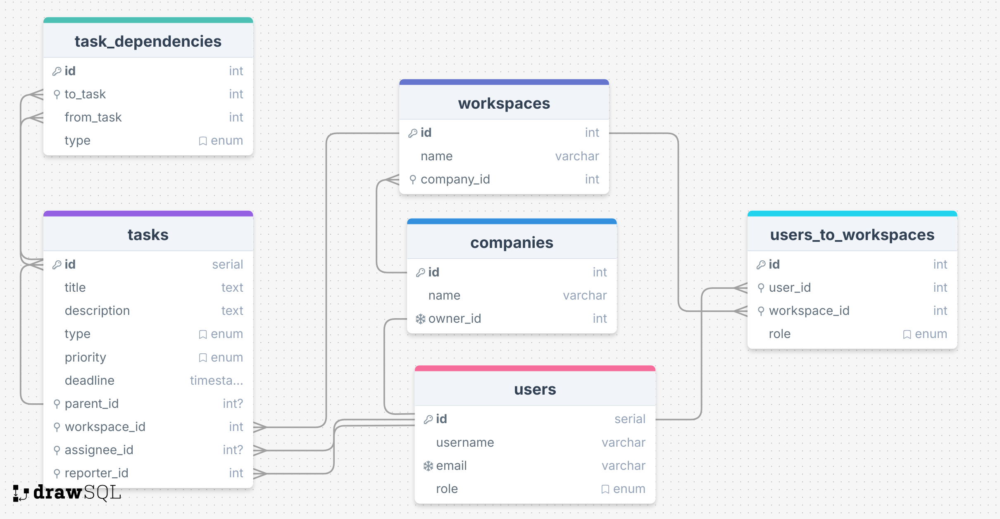

# Overview

This is jira api clone created by **nest** js framework , **mikro orm** and **postgres sql** .

# Application Entities hieararchy


<br>

# Database ERD



<br>

# Getting started

## Installation

```bash
$ npm install
```

# Running the app

```bash
$ npm run start

# watch mode
$ npm run start:dev

# production mode
$ npm run build
$ npm run start:prod
```

### Postman collection : [api collection](./documentation/Jira-api-clone.postman_collection.json)

<br>

# Authorization :

**`Cookie attached jwt token` that is generated after successfull login or registration and is sent with all subsequent requests until expired**

<br>

# API documentatoin :

## Auth :

### Register a New User

Registers a new user in the system, allowing either regular registration or via an invitation link.

- **URL**: `/auth/register`
- **Method**: `POST`
- **Access**: Public
- **Request Body**:

  - **name** (string, required): The user's full name (3-50 characters).
    
  - **email** (string, required if not using an invite token): The user's email (8-50 characters).(if sent with invite token then must be the correct email to which invitation sent)

  - **password** (string, required): Password for the account (8-30 characters).

  - **companyName** (string, optional): Company name associated with the user, required if not using an invite token. (will be ignored if sent with invite token)
  - **inviteToken** (string, optional): JWT token if the user is joining via an invitation.

- **Responses**:

  - **201 Created**: Successfully registered a new user.
  - **400 Bad Request**: Invalid input data or mismatched invite token email.
  - **409 Conflict**: Email already exists.

**Example Request**:

```json
{
  "name": "John Doe",
  "email": "john@example.com", // test_admin@test.com if you want to use the admin role
  "password": "password123",
  "companyName": "ExampleCompany"
}
```

<br>

### Login User

Email and password based authentication

- **URL**: `/auth/login`
- **Method**: `POST`
- **Access**: Public
- **Request Body**:

  - **email** (string, required): The user's email.
  - **password** (string, required): The user's password.

- **Responses**:

  - **200 OK**: Successfully logged in the user.
  - **401 Unauthorized**: Incorrect email or password.

**Example Request**:

```json
{
  "email": "john@example.com",
  "password": "password123"
}
```

<br>

### Logout User

Logs out the user by clearing the authentication token.

- **URL**: `auth/logout`
- **Method**: `POST`
- **Access**: Authenticated

**Response**:

- **200 OK**: Successfully logged out.

<br>

##  Company API

The Company API provides endpoints for managing company records, including creating, updating, and deleting companies. Only **ADMIN** can view all companies, while specific actions are restricted to the company owner.

## Endpoints

### 1. Create Company
Creates a new company and assigns the user an initial default workspace 
- **URL**: `/companies`
- **Method**: `POST`
- **Access**: `Authenticated users`

**Request Body**:  
```json
{
  "name": "CompanyName",
  "ownerId": 1
}
```

**Responses**:
- **201 Created** : Successfully created the company and assigned the user an initial default workspace.
- **403 Forbidden**: User is not authorized to create a company.
- **404 Not Found**: User not found.
- **409 Conflict**: Company with the same name already exists.
- **409 Conflict**: User already has a company.

### 2. Get All Companies
Fetches all registered companies.

- **URL**: `/companies`
- **Method**: `POST`
- **Access**: `ADMIN`

**Responses**:
- **200 OK**: Successfully fetched all companies.
- **404 Not Found**: No companies found.


### 3. Get Company
Fetches a company by ID.

- **URL**: `/companies/:companyId`
- **Method**: `GET`
- **Access**: `Company owner or ADMIN`

**Responses**:
- **200 OK**: Successfully fetched the company.
- **404 Not Found**: Company not found.

### 4. Update Company
Updates a company by ID.

- **URL**: `/companies/:companyId`
- **Method**: `PATCH`
- **Access**: `Company owner or ADMIN`

**Request Body**:

```json
{
  "name": "UpdatedCompanyName"
}
```

**Responses**:
- **200 OK**: Successfully updated the company.
- **404 Not Found**: Company not found
- **409 Conflict**: Company with the same name already exists.

### 5. Delete Company
Deletes a company by ID.

- **URL**: `/companies/:companyId`
- **Method**: `DELETE`
- **Access**: `Company owner or ADMIN`

**Responses**:
- **200 OK**: Successfully deleted the company.
- **404 Not Found**: Company not found.

<br>

## Workspace API

The Workspace API provides endpoints for managing workspaces within companies. Only **Company owner or ADMIN** can view all workspaces in the company , create new workspaces and delete existing workspaces. 

While **workspace Admins** (in addition to the company owner and admin) can update workspace details, invite users , change user role and remove users from the workspace.

## Endpoints

### 1. Create Workspace
Creates a new workspace and assigns the user as the workspace admin.

- **URL**: `/companies/:companyId/workspaces`
- **Method**: `POST`
- **Access**: `Company owner or ADMIN`

**Request Body**:

```json
{
  "name": "WorkspaceName",
  "companyId": 1
}
```

**Responses**:
- **201 Created** : Successfully created the workspace and assigned the user as the workspace admin.
- **403 Forbidden**: User is not authorized to create a workspace.
- **404 Not Found**: User not found.


### 2. Get All Workspaces in Company
Fetches all workspaces in a company.

- **URL**: `/companies/:companyId/workspaces`
- **Method**: `GET`
- **Access**: `Company owner or ADMIN`

**Responses**:
- **200 OK**: Successfully fetched all workspaces in the company.
- **400 Bad Request**: CompanyId is required.

### 3. Get Workspace details
Fetches workspace details by ID.

- **URL**: `/companies/:companyId/workspaces/:workspaceId`
- **Method**: `GET`
- **Access**: `Workspace Admin`

**Responses**:
- **200 OK**: Successfully fetched the workspace details.
- **404 Not Found**: Workspace not found.

### 4. Update Workspace
Updates a workspace by ID.

- **URL**: `/companies/:companyId/workspaces/:workspaceId`
- **Method**: `PATCH`
- **Access**: `Workspace Admin`

**Request Body**:
```json
{
  "name": "UpdatedWorkspaceName"
}
```

**Responses**:
- **200 OK**: Successfully updated the workspace.
- **404 Not Found**: Workspace not found.

### 5. Delete Workspace
Deletes a workspace by ID.

- **URL**: `/companies/:companyId/workspaces/:workspaceId`
- **Method**: `DELETE`
- **Access**: `Company owner or ADMIN`

**Responses**:
- **200 OK**: Successfully deleted the workspace.
- **404 Not Found**: Workspace not found.


### 6. Invite User
Invites a user to join a workspace.

- **URL**: `/companies/:companyId/workspaces/:workspaceId/users/invite`
- **Method**: `POST`
- **Access**: `Workspace Admin`

**Request Body**:
```json
{
  "email": "test_user@test.com",
  "role": "ADMIN" // or "USER"
}
```

**Responses**:

  In production app we will send email but for easy testing we can just return the token

- **200 OK**: Successfully invited the user to join the workspace.
- **400 Bad Request**: invalid input data.
- **404 Not Found**: Workspace not found.


### 7. Get All Users in Workspace
Fetches all users in a workspace no sensitive data returned so workspace admin or user can see all users.

- **URL**: `/companies/:companyId/workspaces/:workspaceId/users`
- **Method**: `GET`
- **Access**: `Workspace member`

**Responses**:
- **200 OK**: Successfully fetched all users in the workspace.
- **400 Bad Request**: invalid workspaceId.

### 8. Update User Role
Updates a user's role in a workspace. only **workspace admin** can change user role. and only **workspace owner** can change admin role.

- **URL**: `/companies/:companyId/workspaces/:workspaceId/users/:userId/change-role`
- **Method**: `PATCH`
- **Access**: `Workspace Admin`

**Request Body**:
```json
{
  "newRole": "ADMIN" // or "USER"
}
```

**Responses**:
- **200 OK**: Successfully updated the user's role.
- **400 Bad Request**: invalid input data.
- **403 Forbidden**: Only Company owner can change admin role.

### 9. Remove User from Workspace
Removes a user from a workspace. only **workspace admin** can remove user. and only **workspace owner** can remove admin.

- **URL**: `/companies/:companyId/workspaces/:workspaceId/users/:userId`
- **Method**: `DELETE`
- **Access**: `Workspace Admin`

**Responses**:
- **200 OK**: Successfully removed the user from the workspace.
- **400 Bad Request**: invalid input data.
- **403 Forbidden**: Only Company owner can remove admins.


<br>

<!-- ## Task API

The Task API provides endpoints for managing tasks, including creating, updating, linking task to another task creating dependencies between tasks , assigning tasks to users, deleting tasks and more. -->

